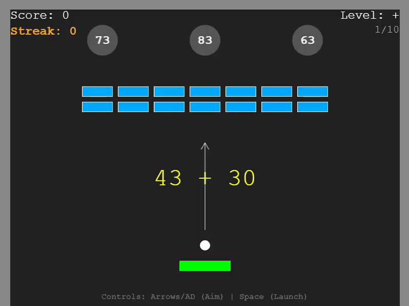

# Math Phaser Game

A web-based educational pinball/brick-breaker game built with Phaser 3. Solves math problems while playing!



## 🎮 Game Overview

Combine the fun of arcade physics with mental math practice. 
*   **Aim & Launch**: Use the paddle to aim and shoot the ball.
*   **Solve**: Hit the hole with the correct answer to the displayed math question.
*   **Survive**: Don't let the ball fall! Break bricks for extra points.
*   **Streak**: Chain correct answers to build your streak! 🔥

## 🕹️ Controls

| Action | Key(s) |
| :--- | :--- |
| **Aim** (Before Launch) | `Left` / `Right` Arrows or `A` / `D` |
| **Launch Ball** | `Space` or `Up` Arrow |
| **Move Paddle** | `Left` / `Right` Arrows or `A` / `D` |
| **Sprint** (2x Speed) | Hold `Shift` while moving |
| **Pause Game** | `ESC` |
| **Restart Level** | `R` |

## ✨ Features

*   **4 Math Levels**: Addition (+), Subtraction (-), Multiplication (*), Division (:).
*   **Dynamic Trajectory**: Visual aiming line to line up your perfect shot.
*   **Streak System**: Streak counter rewards consistent accuracy.
*   **Persistent Stats**: Tracks High Scores and Max Streaks per session.
*   **Juicy Visuals**: Screen shake, popup animations, and particle effects.

## 🌐 Play Online

**[Play the Game Here!](https://rezky-ashari.github.io/math-phaser-game/)**

## 🛠️ Tech Stack

*   **Engine**: [Phaser 3](https://phaser.io/) (Arcade Physics)
*   **Language**: Vanilla JavaScript (ES6+)
*   **Tooling**: [Vite](https://vitejs.dev/) for fast development and building.
*   **Physics**: Arcade Physics (AABB).

## 🚀 How to Run

1.  Clone the repository.
2.  Install dependencies:
    ```bash
    npm install
    ```
3.  Start the development server:
    ```bash
    npm run dev
    ```
4.  Open your browser at the local URL (usually `http://localhost:5173`).

## License

MIT
